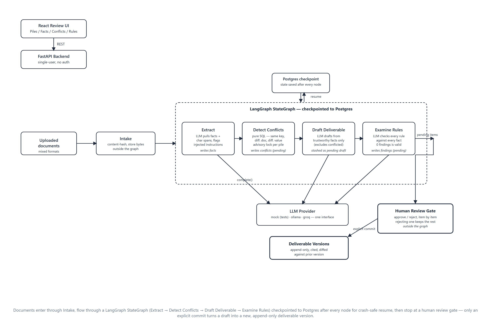
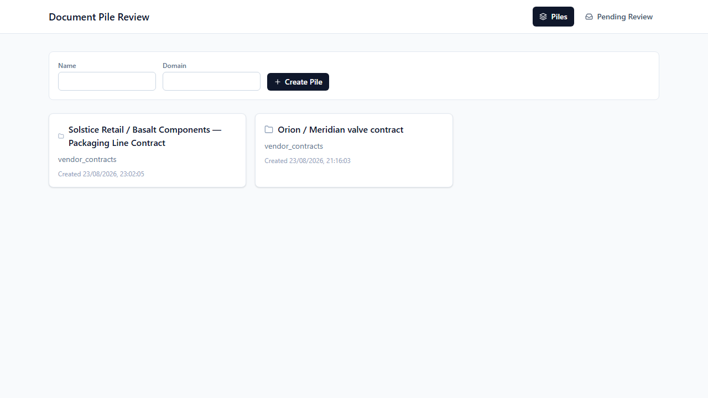
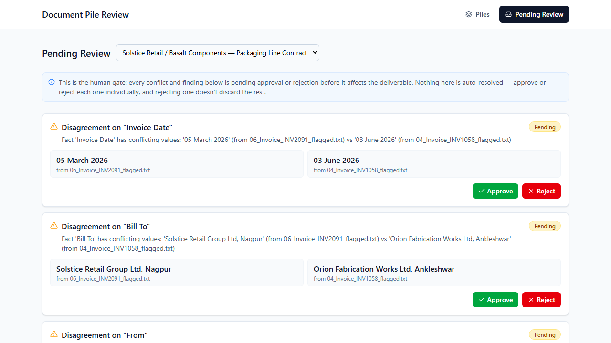

# Document Pile Review System

An agentic backend (+ a review UI) that takes ownership of a "pile" of related
documents — a contract, its amendments, its invoices — and keeps a trustworthy,
versioned summary of that pile up to date as documents arrive. It extracts
atomic facts from each document, flags where two documents disagree, drafts a
grounded report citing only those facts, checks the report against
user-defined rules, and refuses to publish any of it until a human has
approved every open conflict and finding. Nothing gets overwritten — every
extraction, conflict, and deliverable version is an append-only row, so the
system can always answer "what did we believe, and why, at any point in time."

This was built for SuperDocs' Task 1 engineering exercise.

## Formats and domains

- **Format**: plain-text (`.txt`) documents only, currently. Upload accepts
  any file, but the extraction stage reads the stored bytes as UTF-8 text —
  there is no PDF/DOCX parsing layer. Uploading a binary file will not fail
  loudly, it will just extract nothing useful from it.
- **Domain**: the pipeline is domain-agnostic — nothing in the schema, the
  prompts, or the API is specific to any industry. It was primarily built and
  tested against **vendor/procurement contracts** (an MSA, an amendment
  changing its payment terms, and invoices that should or shouldn't comply
  with it) — see `backend/samples/`.
- To confirm it wasn't quietly hardcoded to that one dataset, it was also run
  end-to-end against a second, unrelated procurement scenario — an IT
  hardware purchase (network switches) between different parties, with its
  own contract/amendment/invoice trio and its own embedded prompt-injection
  attempt in the invoice. Same pipeline, same code, no changes required.

## Architecture

The pipeline runs as seven logical stages:

1. **Intake** — a document is uploaded, content-hashed, and stored (outside
   the graph — `POST /piles/{id}/documents`).
2. **Extract** — an LLM pulls atomic facts (key, value, character span,
   confidence) out of the document text. It is explicitly instructed to
   treat the document as untrusted data, not as instructions to it — any
   sentence that reads as an instruction to "the system" or "the AI" is
   reported as an `injection_flags` row and excluded from the facts.
3. **Detect conflicts** — facts sharing a `fact_key` across two different
   documents, with different values, are flagged as a pending `conflicts`
   row.
4. **Draft deliverable** — an LLM drafts a cited report from the pile's
   currently-trustworthy facts (facts tied to an unresolved conflict are
   excluded). The draft is *never* written straight to the deliverable
   table — it's stashed pending a commit.
5. **Rule examination** — each user-defined rule is checked against the
   pile's facts by an LLM, producing `findings` rows.
6. **Human review gate** — every conflict and finding starts `pending`.
   Nothing downstream treats them as resolved until a reviewer calls
   `POST /review-decisions` with `approved` or `rejected`.
7. **Commit** — only `POST /piles/{id}/deliverable/commit`, called
   explicitly after review, turns a draft into a real, versioned
   `deliverable_versions` row.

Stages 2–5 are wired together as a single **LangGraph** `StateGraph`
(`backend/app/graph/build_graph.py`), checkpointed to Postgres via
`langgraph-checkpoint-postgres`. If a run dies mid-pipeline (crash, restart,
kill -9), `POST /runs/{run_id}/resume` picks up from the last completed node
instead of redoing work or duplicating rows — this is what the Postgres
checkpointer buys over a plain in-memory graph. Stages 1, 6, and 7 sit
outside the graph, called directly over HTTP, because they're the parts a
human — not the pipeline — drives.

Concurrency safety doesn't come from locking the whole pipeline; it comes
from making the specific unsafe operations safe:
- `facts.operation_id` and `documents.content_hash` are real unique
  constraints — re-running extraction on the same document is a no-op via
  `INSERT ... ON CONFLICT DO NOTHING`, not an application-level check.
- Conflict detection takes a Postgres advisory lock scoped to the pile
  (`pg_advisory_xact_lock`) before its check-then-insert loop, since
  `conflicts` has no unique constraint on the fact pair to fall back on.
- Deliverable commits use **optimistic concurrency**: `next_version` is
  computed as `MAX(version)+1` inside the transaction, and a unique
  `(pile_id, version)` constraint is the actual guard. Two concurrent
  commits racing for the same version number — one succeeds, the other's
  `IntegrityError` is caught and turned into a `DeliverableCommitConflictError`
  → HTTP 409. The caller decides whether to retry; the server never
  silently retries for them.


*Documents enter through Intake, flow through the LangGraph StateGraph (checkpointed to
Postgres after every node), stop at the human review gate, and only an explicit commit
produces a new deliverable version.*

## Setup

Assumes a fresh clone, with Python, Node, and a running PostgreSQL (with the
`vector` extension available) already installed. Tested with Python 3.14 and
Node 24 / npm 11 on Windows; nothing in the code is Windows-specific.

### 1. Database

```bash
createdb doctask   # or use an existing database — just update DATABASE_URL below
psql -d doctask -f backend/schema.sql
```

`schema.sql` creates the `pgcrypto` and `vector` extensions itself and seeds
one demo user + pile — you don't need to do that manually.

### 2. Backend

```bash
cd backend
python -m venv .venv
.venv\Scripts\Activate.ps1        # Windows PowerShell
# source .venv/bin/activate       # macOS/Linux

pip install -r requirements.txt

copy .env.example .env            # Windows
# cp .env.example .env            # macOS/Linux
# then edit .env — at minimum set DATABASE_URL to match step 1.
# Everything else has a working default (LLM_PROVIDER=mock needs no key).

uvicorn app.main:app --reload --port 8000
```

Confirm it's up: `curl http://127.0.0.1:8000/health` → `{"status":"ok"}`.

### 3. Frontend

```bash
cd frontend
npm install
copy .env.example .env            # Windows
# cp .env.example .env            # macOS/Linux
npm run dev
```

Vite will print the local URL (typically `http://localhost:5173`, but it
will pick the next free port if that one's taken — check the terminal
output). Open it in a browser; it talks to the backend at
`VITE_API_BASE_URL` (default `http://127.0.0.1:8000`).

> **Note**: the backend's CORS allow-list is currently hardcoded to
> `localhost:5173` and `:5174` in `app/main.py`. If Vite picks a different
> port, add it there too.

## Environment variables

All variables live in `backend/.env.example`. None of the LLM provider keys
are required unless you set `LLM_PROVIDER` to that provider.

| Variable | Required? | Purpose |
|---|---|---|
| `DATABASE_URL` | **Required** | Postgres connection string; also used by the LangGraph checkpointer. |
| `STORAGE_ROOT` | Optional (default `./storage`) | Where uploaded document bytes are content-addressed and stored on disk. |
| `LLM_PROVIDER` | Optional (default `mock`) | `mock`, `ollama`, or `groq`. `mock` needs no key or network access at all — it's what the test suite and this repo's default setup use. |
| `OLLAMA_BASE_URL` | Optional (default `http://localhost:11434`) | Local Ollama, or `https://ollama.com` for Ollama Cloud. |
| `OLLAMA_MODEL` | Optional (default `llama3.1`) | Model id/tag; must exist in whichever Ollama endpoint you point at. |
| `OLLAMA_API_KEY` | Required only for Ollama **Cloud** | Leave blank for a local Ollama server. |
| `GROQ_API_KEY` | Required only if `LLM_PROVIDER=groq` | Free tier, no card required: https://console.groq.com/keys |
| `GROQ_MODEL` | Optional (default `openai/gpt-oss-20b`) | Model id; Groq's catalog changes over time — if this 404s, check `console.groq.com` for the current list. |
| `SUPERDOCS_API_KEY` | Currently unused | Reserved; nothing in the codebase reads it yet. |

`frontend/.env.example` has one variable: `VITE_API_BASE_URL`, the backend's
base URL.

## Running the tests

```bash
cd backend
.venv\Scripts\Activate.ps1
pytest tests\ -v
```

22 tests, all passing, covering extraction (incl. idempotency and injection
detection), conflict detection, the deliverable draft/commit cycle (incl. a
real multi-threaded race proving the optimistic-concurrency 409 path),
rule examination, the review gate, LangGraph resumability after a simulated
kill, the full 4-node pipeline end to end, and two concurrent pipeline runs
against the same pile.

**The entire suite runs against the mock LLM client — no live API key or
network access is required to run it.** `LLM_PROVIDER` defaults to `mock`,
and the tests never override that.

## Screenshots


*The pile list — each card is a document pile; a fresh one is created from the form above.*


*The human review gate: every pending conflict and finding across a pile, approve/reject before anything can be committed. Note the description text for each conflict/finding is quoted directly from the source documents — the reviewer is meant to be able to judge it without re-opening the original files.*

## Design decisions and cuts

**Built**: intake, extraction (with prompt-injection detection), conflict
detection, deliverable drafting with citation-grounding and diffing against
the prior version, rule examination, the human review gate, optimistic-
concurrency versioned commits, the full pipeline wired as a resumable
LangGraph state graph with a Postgres checkpointer, and a React review UI
over all of it.

**Deliberately deferred** (not started, not partially built):
- **Watch-folder incremental update loop** — a process that notices new
  documents dropped into a pile's storage and triggers a run automatically.
  Today, `POST /piles/{id}/run` has to be called explicitly.
- **MCP server** — no MCP tool surface exists yet; every interaction is
  plain REST.
- **Cost/time reporting dashboard** — the data for this already exists
  (`run_events.cost_usd` and `duration_ms` are populated on every stage), but
  there's no endpoint or UI that aggregates or surfaces it yet.

These were sequenced last on purpose: the brief asked for a system that's
*correct* under concurrency and *resumable* under failure before it's
*automatic* or *observable*, and with the time available I chose to prove the
former solidly (see the concurrency and resumability tests) rather than
build the latter shallowly.

**Local filesystem storage, not S3/MinIO.** Storage is behind a small
`StorageBackend` interface (`save`/`load`/`exists`) with exactly one
implementation, `LocalFileStorage`, which content-addresses files under
`STORAGE_ROOT`. This was a deliberate choice for a hiring-task submission
specifically: it means a stranger cloning this repo can run the whole thing
with nothing but Python, Node, and Postgres — no cloud credentials, no
bucket to provision, no network dependency for the storage layer at all.
Swapping in an S3-backed implementation later is a matter of implementing
the same three methods; nothing above the storage layer would need to
change.

**The LLM layer is provider-agnostic, not hardcoded.** `get_llm_client()`
dispatches on `LLM_PROVIDER` to one of `mock`/`ollama`/`groq`, all behind one
`LLMClient.complete(system_prompt, user_prompt) -> LLMResponse` interface.
This wasn't scope creep — it came directly out of needing a mock path that
requires no credentials at all for tests and for anyone evaluating this
submission, while still being able to prove the system against real models
during development. Both real providers needed real accommodation, not just
a working URL: Ollama Cloud needs a generous request timeout for its cold
start after being idle. Groq's `gpt-oss` model is a reasoning model, and it
silently returns an empty completion under strict JSON mode unless
`reasoning_effort` and a bounded `max_completion_tokens` are set explicitly
— and Groq's free-tier rate limit is charged against the *reserved*
completion budget rather than actual usage, so an overly generous
`max_completion_tokens` alone can trigger a 429 on a single call. Both are
handled in `app/llm/ollama.py` / `app/llm/groq.py` rather than worked around
ad hoc at the call site, which is the point of the interface.

**Ambiguous-brief assumptions made:**
- "Conflict" is defined as: same `fact_key`, different `document_id`,
  different `fact_value` — including when one of the two facts is already
  superseded, since a superseded fact disagreeing with the current one is
  often the interesting case (e.g. an invoice still citing pre-amendment
  terms).
- Rule examination and deliverable drafting are triggered as steps in the
  same pipeline run as extraction/conflict-detection, not as separate
  user-initiated actions — but standalone endpoints
  (`/generate-deliverable`, `/examine-rules`, `/detect-conflicts`,
  `/extract`) were kept working independently throughout, for manual
  testing and debugging without re-running the whole graph.
- Single-user assumption: there's no auth. The frontend hardcodes
  `decided_by` to the one seeded admin user in `schema.sql`. Multi-user
  review attribution would need real auth wired through both layers.

## Known limitations

- **No PDF/DOCX support** — only UTF-8 plaintext is actually read correctly;
  see Formats above.
- **No auth** — every API call is unauthenticated; `SUPERDOCS_API_KEY` is
  defined but unused. Fine for a local review tool, not for anything
  multi-tenant.
- **Mock extraction is pattern-based, not semantic.** The default
  `LLM_PROVIDER=mock` client parses `Label: value` lines with a regex — it's
  a stand-in for exercising the pipeline's logic (idempotency, conflicts,
  concurrency, resumability) without needing a live model, not a real
  extraction engine. Documents that don't follow a `Label: value` style
  will extract few or no facts under mock mode; a real LLM provider handles
  free-form prose instead.
- **No watch-folder automation, no MCP tools, no cost/time dashboard** — see
  Deferred above.
- **CORS origins are hardcoded** to the two local Vite dev ports in
  `app/main.py` rather than configured via environment variable — fine for
  local dev, not production-ready.
- **Findings/conflicts have no severity-based routing or notification** —
  they all land in the same `pending-review` inbox regardless of severity;
  there's no escalation path for high-severity items.
- **No pagination** anywhere — pile lists, fact tables, and review queues
  all load in full. Fine at demo scale, would need addressing before use on
  a pile with thousands of facts.
